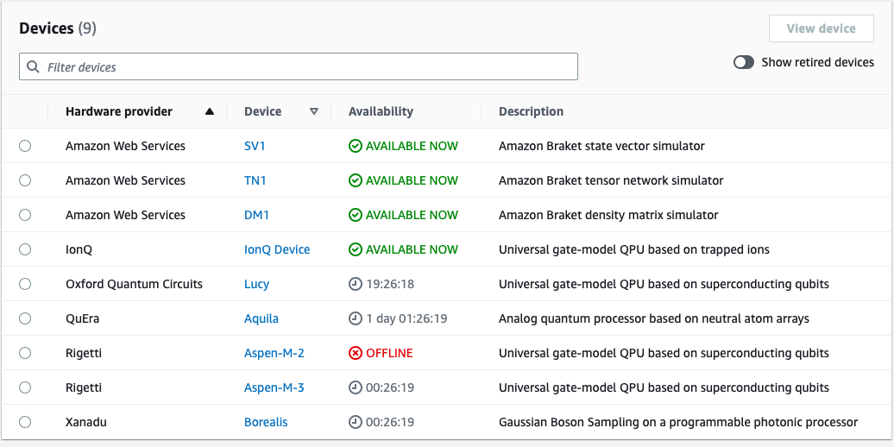
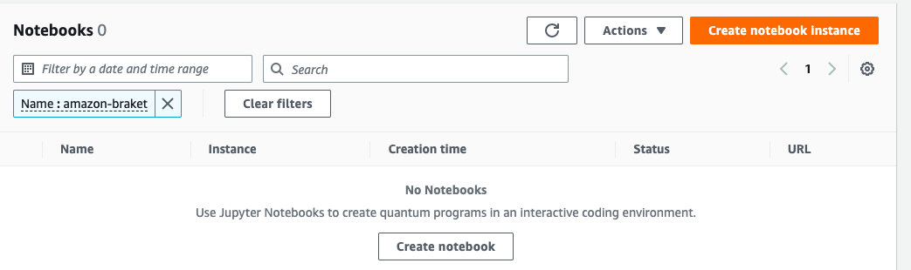

# AWS Braket Quantum code

As I experiment and work through learning, I'll be saving code that I can execute in the Jupyter notebooks

## Beginning steps

Follow this beginner-step guideline at this link  
[AWS Docs](https://docs.aws.amazon.com/braket/latest/developerguide/braket-get-started-run-circuit.html)

## Usage

I have provided a series of screen captures to show the various tabs in AWS Braket you will be using  

### the list of simulators and real quantum devices and availability  
  
### the interface to launch and view your managed Jupyter notebooks  
  
### after completion the links to the tasks and run statuses  

## Contributing

Feel free to clone and start your own learning.

## License
AWS owns the rights to the linked documentation
