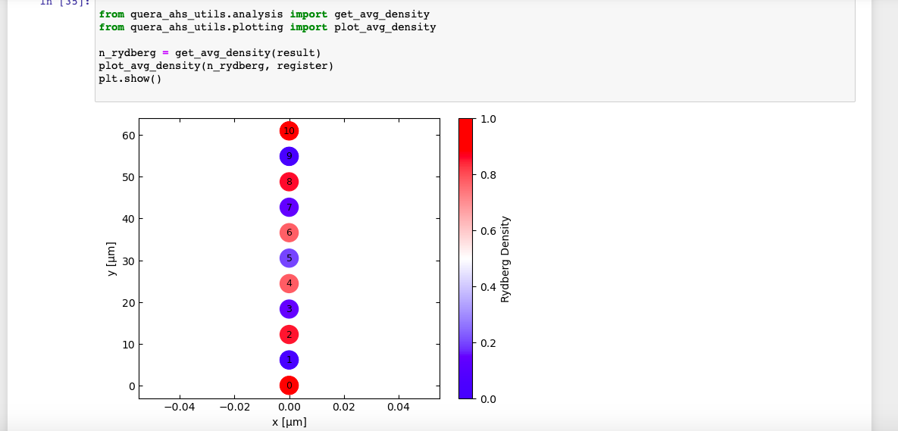
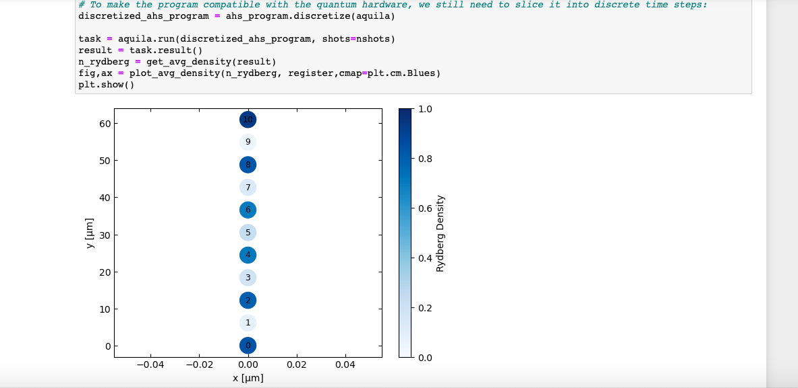

## Why is this section called and beyond?  
We are getting to get into the realm of science that sounds more like sci-fi  
I began to explore the other devices available in AWS Braket service and this one really intrigued me, it is from a company in Boston, MA QuEra and the hardware is Aquila.  
The technology is based on a neutral-atom quantum processor.  

#### What is neutral-atom quantum processor you ask?  
Well hold on to your hats...  
In a neutral-atom quantum processor, atoms are suspended in ultrahigh vacuum by arrays of tightly focused laser beams called optical tweezers. Researchers have scaled up to arrays of more than 100 alkali atoms, each of which has one valence electron, and executed quantum algorithms using smaller arrays.  

#### Links of interest  

[QuEra How it works](https://www.quera.com/neutral-atom-platform)  

[QuEra base Hello world code](https://www.quera.com/using-aquila)  

[AWS notebook examples on analog hamiltonian](https://github.com/aws/amazon-braket-examples/tree/main/examples/analog_hamiltonian_simulation)  

#### image from the simulated run  

  

#### screen capture ran on actual hardware  

### Notewothy   
This is obviously just a beginning on this, I've yet to run the program to it's conclusion on the actual hardware device as it has limited operational hours 11am till 2pm EST on Tuesday, Wednesday and Thursdays when I do successfully execute it, I'll be sure to add an update here  
--updated 03/02  added screen capture of success on QuEra hardware

### Usage  
The base of this code is primarily from QuEra and AWS I am providing it for self-study and learning, I claim no ownership and all rights belong to the perspective companies.
