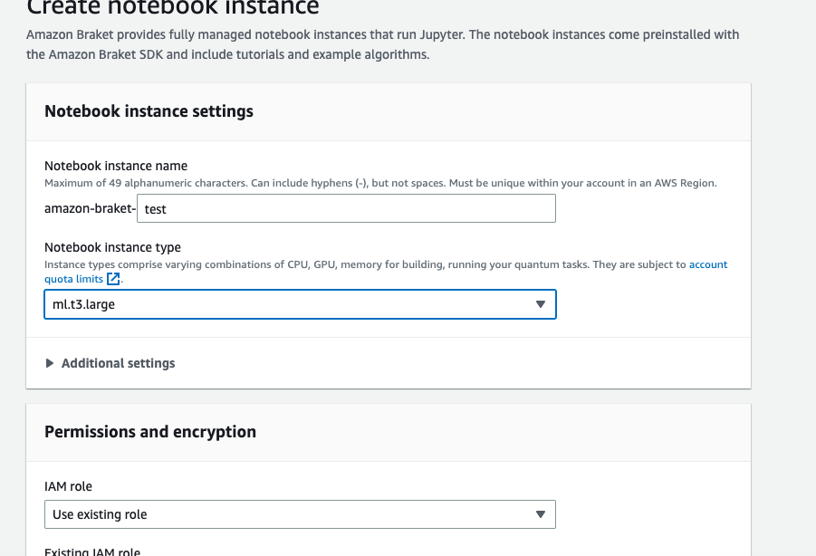
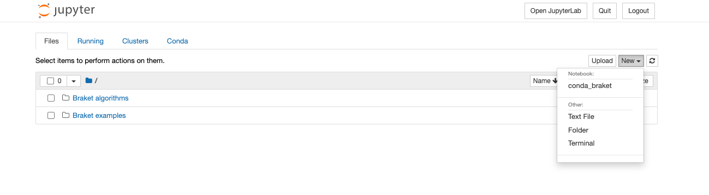
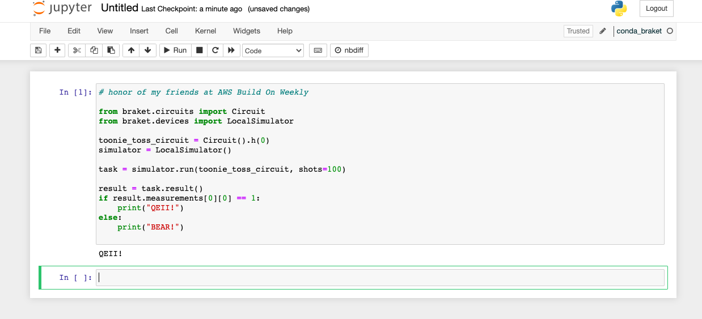

#### Toonie Toss Quantum  

Fun little one off program, this uses a single Qubit and applies a Hadamard gate to provide a uniform superposed state.  

The number of shots provide a equal chance of the Qubit measuring in the 0 or 1 state making for a perfect 50/50 likelihood of your coin toss being fair and random.  

Of course we can modify this script by not running on the local simulator, but on actual hardware but this script is for fun.  

#### aws braket console create notebook  
it's important to select the ml.t3.large as the most reliable instance that launches

  

#### jupyter notebook select new then conda_braket  
We select new and conda_braket as this ipynb will come with all of the needed python libraries including the aws braket sdk pre-installed  

  

### WARNING  
remember to quit your notebook and to stop and possibly delete it from the Braket console when you are done experimenting, this notebook is inexpensive but it still cost real _money_ that is _billable by the hour_. 

#### adding a screen capture of the results run in a Jupyter notebook inside Amazon Braket service  

