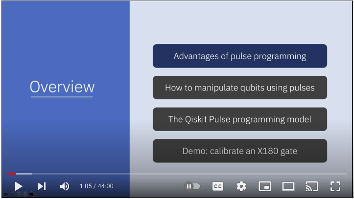

### Unfinished learning  
A folder to capture notebooks and scripts for unfinished weekend learning  

#### currently capturing  
currently learning about lower level pulse control using frames and ports  
[AWS Hello Pulse](https://docs.aws.amazon.com/braket/latest/developerguide/braket-hello-pulse.html)  
[AWS Blog post](https://aws.amazon.com/blogs/quantum-computing/amazon-braket-launches-braket-pulse-to-develop-quantum-programs-at-the-pulse-level/)  
[On Frames and Ports](https://docs.aws.amazon.com/braket/latest/developerguide/braket-roles-frames-ports.html)  

#### added pulse_result.json  
added result.json from actual run on Rigetti hardware, you can see by the results the specified Qubits that were called the pulse and the results of the run.

#### video discussing pulse control, why it's even a thing. This is from IBM and discuss Qiskit but the concept is still applicable  

  
