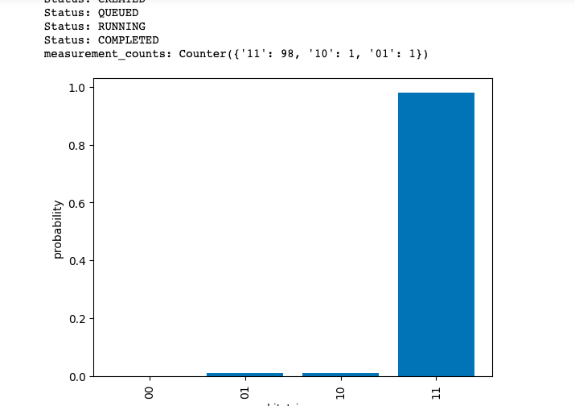

### welcome to superdense coding with quantum hardware  
#### what is superdense coding?  
Quantum superdense coding is a communication protocol that takes advantage of the strange properties of quantum mechanics to send secret messages in a more efficient way than classical communication systems.

The basic idea is that two parties, let's call them Alice and Bob, each have a qubit, which is a quantum version of a classical bit. These qubits are entangled, which means that whatever happens to one qubit will affect the other, regardless of the distance between them.

Alice can manipulate her qubit in a way that encodes some information onto it. For example, she could apply a gate that flips the qubit's state, or a gate that rotates its state. The specific gate she chooses encodes a specific message that she wants to send to Bob.

Alice then sends her qubit to Bob. When Bob receives the qubit, he measures both qubits in a specific way that extracts the information encoded by Alice. Because the two qubits are entangled, Bob can recover the information encoded by Alice using only one qubit measurement, which means that Alice was able to send two classical bits of information to Bob using only one qubit.

In summary, quantum superdense coding is a way to send secret messages more efficiently than classical communication systems by exploiting the unique properties of quantum mechanics, such as entanglement and the ability to encode information onto individual qubits.

[Medium article](https://medium.com/geekculture/understanding-superdense-coding-c10b42adecca#:~:text=Quantum%20teleportation%20is%20a%20process,flipped%20version%20of%20Quantum%20Teleportation.)  

[AWS notebook](https://github.com/aws/amazon-braket-examples/blob/main/examples/getting_started/4_Superdense_coding/4_Superdense_coding.ipynb)  

#### Image captures the output of selecting 11 as the encoded message

### Usage  
Review the README at the base of the repository for a good starting point, and try out the service in AWS and hopefully learn, and have fun.
