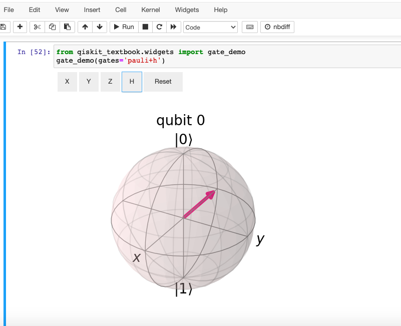

## Week one highlights  
If you are curious week one was outlined & chronicled here:  

[LinkedIn post #1](https://www.linkedin.com/feed/update/urn:li:activity:7030210727537754113/)  
also of note much of the code base and learning came from  

[AWS blog post](https://aws.amazon.com/blogs/quantum-computing/generating-quantum-randomness-with-amazon-braket/)  

Other really good things I found to learn with  
[Medium article on gates](https://towardsdatascience.com/demystifying-quantum-gates-one-qubit-at-a-time-54404ed80640)  

Utilizing the notebook you can run your gate learning exercises from this helpful doc  

[Doc](https://qiskit.org/textbook/ch-states/single-qubit-gates.html)  

### image from notebook  
 

### Usage  
Review the README at the base of the repository for a good   
starting point, and try out the service in AWS and hopefully  
learn, and have fun.
