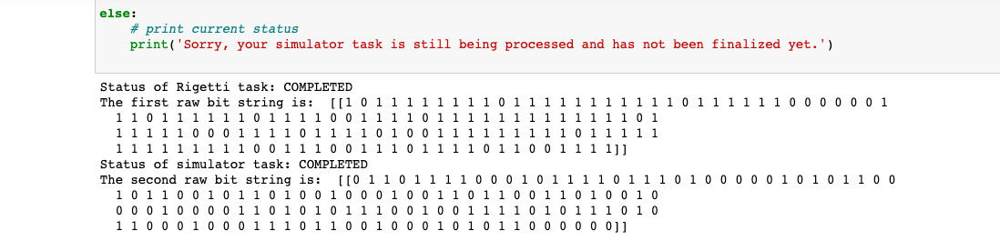
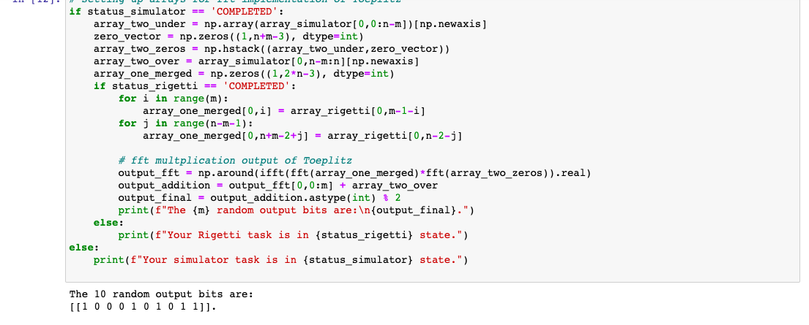

## Week three highlights  
Beginning work on week three by running the full random number generator code:  

[AWS ref notebook](https://github.com/aws/amazon-braket-examples/blob/main/examples/advanced_circuits_algorithms/Randomness/Randomness_Generation.ipynb)  

#### you are encouraged to read the above ipynb documentation between the cells but I've included some helpful readings  

[What's Entropy?](https://towardsdatascience.com/entropy-is-a-measure-of-uncertainty-e2c000301c2c)  
[Fast Fourier Transform FFT](https://towardsdatascience.com/fast-fourier-transform-937926e591cb)  
[How do I use np.newaxis?](https://stackoverflow.com/questions/29241056/how-do-i-use-np-newaxis)  

### image of full_random_solution.py output in notebook

#### image of modified_complete_random.py generated rigetti and sv1  

  

#### Final generated result for random generated number  

  

### Usage  
Review the README at the base of the repository for a good   
starting point, and try out the service in AWS  
and hopefully learn, and have fun.
