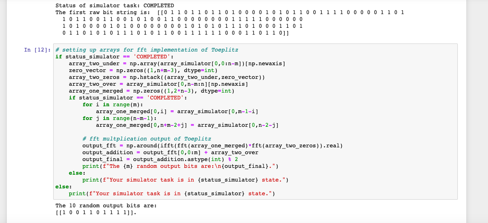

## Week three highlights  
Beginning work on week three by running the full random number generator code:  

[AWS ref notebook](https://github.com/aws/amazon-braket-examples/blob/main/examples/advanced_circuits_algorithms/Randomness/Randomness_Generation.ipynb)  

### image of full_random_solutio.py output in notebook

  

### Usage  
Review the README at the base of the repository for a good   
starting point, and try out the service in AWS  
and hopefully learn, and have fun.
