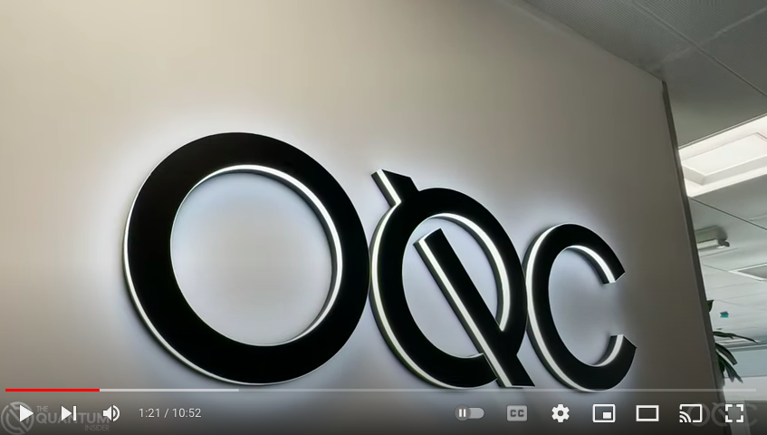

## Week four highlights  
This is really the most basic operation of a circuit, the twist in the week  
four execution was I was curious to interact with another QPU and this one  
is located in Reading, United Kingdom operated by Oxford Quantum Circuits and named LUCY  
If you are curious week two was outlined & chronicled here:  

[Information about OQC](https://oxfordquantumcircuits.com/technology)  
a reminder the running your first circuit using the Amazon Braket Python SDK  

[AWS link](https://docs.aws.amazon.com/braket/latest/developerguide/braket-get-started-run-circuit.html)  

Other really good things I found to learn with  
[Git repo for qiskit braket](https://github.com/qiskit-community/qiskit-braket-provider)  

[Qiskit community ipynb](https://github.com/qiskit-community/qiskit-braket-provider/blob/main/docs/tutorials/0_tutorial_qiskit-braket-provider_overview.ipynb)  

#### Example image of across_the_pond.py output in notebook

  

#### Great video from YouTube with an inside look of Oxford Quantum Circuits and Ilana Wisby CEO of OQC  

### Usage  
Review the README at the base of the repository for a good starting point, and try out the service in AWS and hopefully learn, and have fun.
